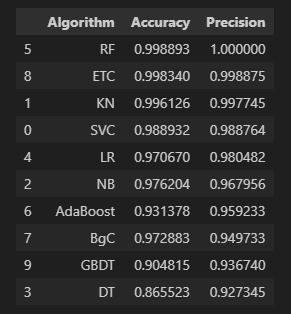

# Spam Message Detection


The "spam-message-detection" is dedicated to the development of algorithms and models for the detection of spam messages in textual data. This project aims to provide efficient and accurate solutions for identifying and filtering out spam messages to enhance user experience and maintain the integrity of communication channels.

## Demo

```bash
https://spam-message-detection.streamlit.app/
```


## How to Run

Steps


  1) Clone the repository
```bash
    https://github.com/Atharva1921/Spam_Message_Detection.git
```
  2) Create a conda environment after opening the repository
```bash
    conda create -n venv python=3.11 -y
    conda activate venv
```
  3) Install the requirements
```bash
    pip install -r requirements.txt
```
  4) Run the app
```bash
    streamlit run app.py
```
  Open up the localhost link provided

  5) Enter the Message that you want to detect

  6) Click the predict button for spam detection

    
## Models performance


## Video

[![Watch the video]](https://youtu.be/5fWw-Vg0K1k)